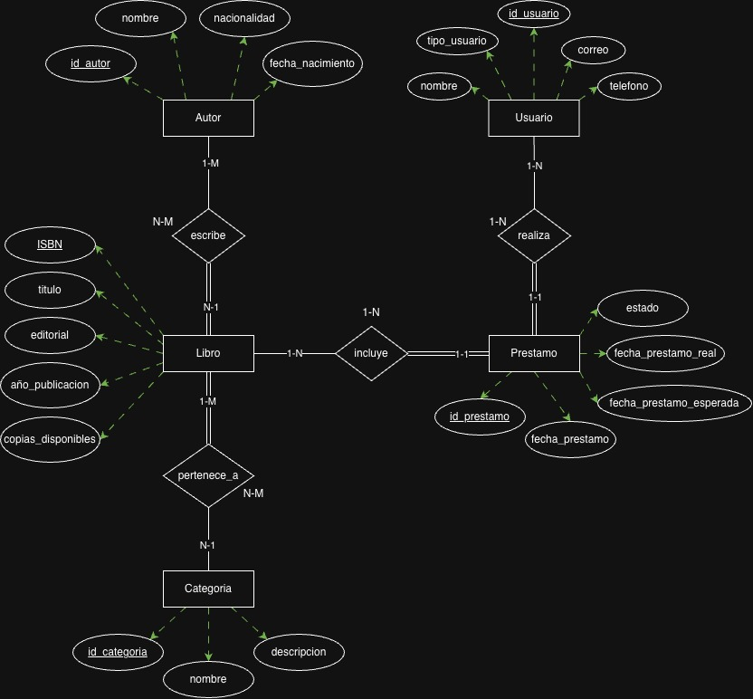

### Pregunta repaso

¿Cuál es la diferencia entre una entidad fuerte y una entidad débil? ¿Puedes dar un ejemplo de cada una?

> La diferencia consta de que las entidades fuertes existen de forma independiente y poseen su clave primaria, sin embargo, las entidades debiles dependen de otras entidades para existir y no posea una clave primaria propia completa. Ejemplo de ellos es la entididad FACTURA y la entidad ITEM_FACTURA, la segunda es una entidad debil ya que depende de la la entidad fuerte factura pra existir.

## Actividad practica

### Diseño de Diagrama ER: Sistema de Biblioteca Universitaria

**Escenario del Sistema**

La biblioteca de CORHUILA necesita un sistema para gestionar sus operaciones. Analiza los siguientes requerimientos:

- La biblioteca tiene múltiples libros. Cada libro tiene ISBN, título, editorial, año de publicación y número de copias disponibles.
- Los libros son escritos por autores. Un libro puede tener varios autores, y un autor puede haber escrito varios libros.
- Los usuarios (estudiantes y docentes) pueden realizar préstamos de libros.
- Cada préstamo registra la fecha de préstamo, fecha de devolución esperada y fecha de devolución real.
- Los libros están organizados por categorías (Programación, Matemáticas, Literatura, etc.). Un libro puede pertenecer a varias categorías.

**Solución**

1. Identificación de entidades.
   - Libro
   - Autor
   - Usuario
   - Prestamo
   - Categoria

2. Definir los atributos.

   | Entidad   | Atributos                                                                             | Clave primaria |
   | --------- | ------------------------------------------------------------------------------------- | -------------- |
   | Libro     | ISBN, titulo, editorial, año_publicacion, copias_disponibles                          | ISBN           |
   | Autor     | id_autor, nombre, nacionalidad, fecha_nacimiento                                      | id_autor       |
   | Usuario   | id_usuario, tipo_usuario, nombre, correo, telefono                                    | id_usuario     |
   | Prestamo  | id_prestamo, fecha_prestamo, fecha_devolucion_esperada, fecha_devolucion_real, estado | id_prestamo    |
   | Categoria | id_categoria, nombre, descripcion                                                     | id_categoria   |

3. Identificacion de relaciones, su cardinalidad y participación.

   | Relación    | Entidades          | Cardinalidad | Participación   | Justificación                                                                             |
   | ----------- | ------------------ | ------------ | --------------- | ----------------------------------------------------------------------------------------- |
   | escribe     | AUTOR - LIBRO      | N:M          | Parcial / Total | Un autor puede no tener libros en la biblioteca. Todo libro debe tener al menos un autor. |
   | realiza     | USUARIO - PRÉSTAMO | 1:N          | Parcial / Total | Un usuario puede no tener préstamos activos. Todo préstamo debe tener un usuario.         |
   | incluye     | PRÉSTAMO - LIBRO   | N:1          | Total / Parcial | Todo préstamo es de un libro. Un libro puede no estar prestado.                           |
   | pertenece_a | LIBRO - CATEGORÍA  | N:M          | Total / Parcial | Todo libro debe tener al menos una categoría. Una categoría puede no tener libros.        |

4. Construir el diagrama.

